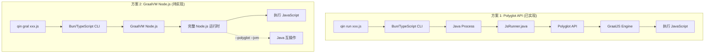
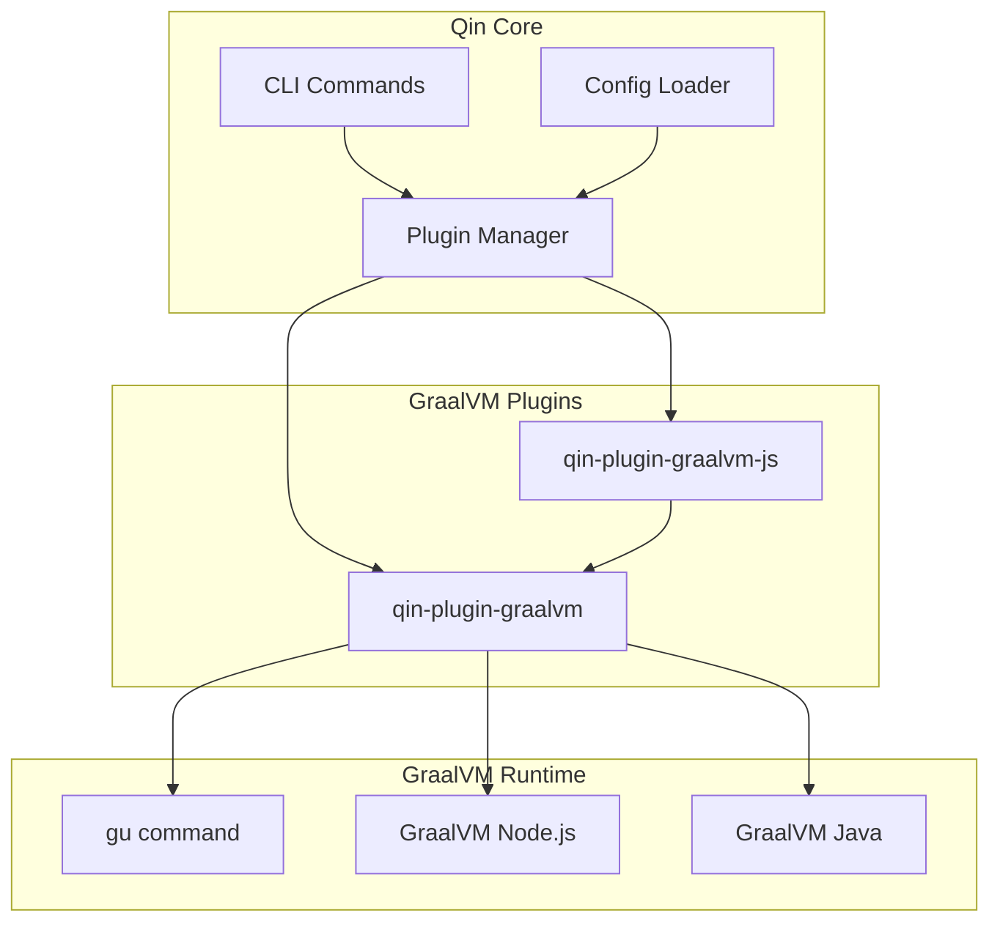
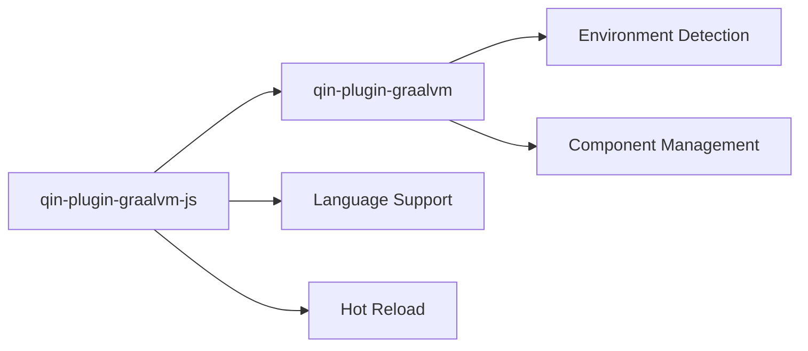

# Design Document: GraalVM Node.js Support

## Overview

本设计为 Qin 构建工具添加 GraalVM JavaScript 运行时支持。我们提供**两种方案**来满足不同的使用场景：

### 方案对比

| 特性 | 方案 1: Polyglot API | 方案 2: GraalVM Node.js |
|------|---------------------|------------------------|
| **命令** | `qin run xxx.js` | `qin gral xxx.js` |
| **运行时** | Java + GraalJS (Polyglot API) | GraalVM Node.js Runtime |
| **Node.js API** | ❌ 不支持 | ✅ 完整支持 |
| **npm 生态** | ❌ 不支持 | ✅ 完整支持 |
| **Java 互操作** | ✅ 内置支持 (`Java.type()`) | ✅ 需要 `--polyglot --jvm` |
| **依赖要求** | Java 11+ (任意 JDK) | GraalVM + `gu install nodejs` |
| **实现状态** | ✅ **已实现** | 🚧 **待实现** |

### 方案 1: Polyglot API (已实现)

```
qin run xxx.js → Java Process → JsRunner.java → Polyglot API → GraalJS Engine
```

- 位置: `.kiro/specs/graalvm-polyglot-js-runner/`
- 特点: 轻量级，任何 Java 11+ 都能运行，但不支持 Node.js 内置模块
- 适用场景: 简单脚本、需要 Java 互操作的场景

### 方案 2: GraalVM Node.js (本文档)

```
qin gral xxx.js → GraalVM Node.js → 完整 Node.js 运行时 (+ 可选 Java 互操作)
```

- 特点: 完整的 Node.js 兼容性，支持 npm 生态
- 适用场景: 需要 Node.js API 的应用、使用 npm 包的项目

---

本文档描述**方案 2**的设计，通过两个插件实现：

1. **qin-plugin-graalvm** - 基础插件，提供 GraalVM 环境检测、版本管理和核心能力
2. **qin-plugin-graalvm-js** - JavaScript 语言插件，提供 GraalVM Node.js 运行时支持

设计遵循 Qin 现有的插件架构（参考 `qin-plugin-java`），确保与现有系统的一致性和兼容性。

> **注意**: GraalVM 25 仍然支持 Node.js，需要通过 `gu install nodejs` 安装。GraalVM 的 Node.js 运行时基于 GraalJS 引擎，与原始 Node.js (V8) 高度兼容。

## Architecture

### 两种方案的执行流程对比



### 方案 2 插件架构



### 插件依赖关系



### 命令使用场景

| 场景 | 推荐命令 | 原因 |
|------|---------|------|
| 简单脚本 + Java 互操作 | `qin run script.js` | 无需安装 GraalVM，Java 互操作内置 |
| HTTP 服务器 | `qin gral server.js` | 需要 Node.js `http` 模块 |
| 使用 npm 包 | `qin gral app.js` | 需要完整 Node.js 模块解析 |
| Express/Koa 应用 | `qin gral app.js` | 需要 Node.js 生态 |
| 纯计算脚本 | `qin run calc.js` | 轻量级，启动快 |

## Components and Interfaces

### 1. qin-plugin-graalvm (基础插件)

```typescript
// packages/qin-plugin-graalvm/src/index.ts

export interface GraalVMInfo {
  /** GraalVM 安装路径 */
  home: string;
  /** GraalVM 版本 */
  version: string;
  /** 已安装的组件列表 */
  components: string[];
  /** Node.js 可执行文件路径 */
  nodePath?: string;
  /** Java 可执行文件路径 */
  javaPath?: string;
}

export interface GraalVMPluginOptions {
  /** 自定义 GraalVM 路径，默认自动检测 */
  home?: string;
  /** 是否在缺少组件时自动安装 */
  autoInstall?: boolean;
}

export interface GraalVMPlugin extends QinPlugin {
  /** 获取 GraalVM 信息 */
  getInfo(): GraalVMInfo | null;
  /** 检查组件是否已安装 */
  isComponentInstalled(name: string): boolean;
  /** 获取 GraalVM Home 路径 */
  getGraalVMHome(): string | null;
  /** 获取已安装组件列表 */
  getInstalledComponents(): string[];
}

export function graalvm(options?: GraalVMPluginOptions): GraalVMPlugin;
```

### 2. qin-plugin-graalvm-js (JavaScript 插件)

```typescript
// packages/qin-plugin-graalvm-js/src/index.ts

export interface GraalVMJsPluginOptions {
  /** JavaScript 入口文件 */
  entry?: string;
  /** 热重载配置 */
  hotReload?: boolean | { debounce?: number; verbose?: boolean };
  /** 额外的 Node.js 参数 */
  nodeArgs?: string[];
  /** 是否启用 Java 互操作 */
  javaInterop?: boolean;
}

export interface GraalVMJsLanguageSupport extends LanguageSupport {
  name: "graalvm-js";
  extensions: [".js", ".mjs"];
}

export function graalvmJs(options?: GraalVMJsPluginOptions): QinPlugin;
```

### 3. 配置扩展

```typescript
// 扩展 QinConfig 类型
interface QinConfig {
  // ... 现有配置
  
  /** GraalVM 配置 */
  graalvm?: {
    /** GraalVM 安装路径 */
    home?: string;
    /** JavaScript 支持配置 */
    js?: boolean | {
      /** 入口文件 */
      entry?: string;
      /** 热重载 */
      hotReload?: boolean;
      /** Node.js 参数 */
      nodeArgs?: string[];
    };
  };
}
```

## Data Models

### GraalVM 检测结果

```typescript
interface GraalVMDetectionResult {
  /** 是否检测到 GraalVM */
  found: boolean;
  /** 检测方式: 'env' | 'path' | 'gu' */
  detectedBy?: 'env' | 'path' | 'gu';
  /** GraalVM 信息 */
  info?: GraalVMInfo;
  /** 错误信息 */
  error?: string;
}
```

### JavaScript 编译结果

```typescript
interface JsCompileResult {
  /** 是否成功 */
  success: boolean;
  /** 语法错误列表 */
  syntaxErrors?: Array<{
    file: string;
    line: number;
    column: number;
    message: string;
  }>;
  /** 验证的文件数量 */
  validatedFiles: number;
}
```

### 热重载状态

```typescript
interface HotReloadState {
  /** 是否启用 */
  enabled: boolean;
  /** 监听的文件模式 */
  watchPatterns: string[];
  /** 当前进程 */
  process?: ChildProcess;
  /** 环境变量 */
  env: Record<string, string>;
  /** 命令行参数 */
  args: string[];
}
```

## Correctness Properties

*A property is a characteristic or behavior that should hold true across all valid executions of a system-essentially, a formal statement about what the system should do. Properties serve as the bridge between human-readable specifications and machine-verifiable correctness guarantees.*

Based on the prework analysis, the following correctness properties have been identified:

### Property 1: GraalVM Detection Consistency

*For any* system environment configuration (with or without GRAALVM_HOME, with or without gu command), the detection function SHALL return consistent results where:
- If GRAALVM_HOME is set and valid, detection succeeds via 'env' method
- If gu command is available, detection succeeds via 'gu' method
- If neither is available, detection returns found=false with appropriate error

**Validates: Requirements 1.1, 1.2, 4.2**

### Property 2: Configuration Parsing Validity

*For any* valid qin.config.ts configuration object containing graalvm settings, the configuration parser SHALL:
- Enable GraalVM JS support when `graalvm.js` is truthy
- Use the specified entry point when `graalvm.js.entry` is provided
- Use GraalVM's Node.js binary path instead of system Node.js
- Return validation errors for invalid configuration structures

**Validates: Requirements 2.1, 2.2, 2.3, 2.4**

### Property 3: Plugin API Consistency

*For any* GraalVM installation state, the plugin API methods SHALL return consistent results where:
- `getGraalVMHome()` returns the installation path or null if not found
- `getInstalledComponents()` returns an array of component names (possibly empty)
- `isComponentInstalled(name)` returns true if and only if the component exists in the components array

**Validates: Requirements 4.3, 4.4, 4.5**

### Property 4: JavaScript Execution Command Construction

*For any* JavaScript entry point and argument list, the execution command SHALL:
- Use GraalVM's Node.js binary from the detected GraalVM home
- Include the entry point file path as the first argument
- Append all user-provided arguments after the entry point
- Include proper classpath for Java interop when enabled

**Validates: Requirements 3.1, 3.4, 5.4**

### Property 5: File Extension Handling

*For any* file with `.js` or `.mjs` extension, the graalvmJs plugin SHALL:
- Register as the handler for these extensions
- Validate syntax when compile is called
- Execute using GraalVM Node.js when run is called

**Validates: Requirements 5.2, 5.3**

### Property 6: Hot Reload State Preservation

*For any* hot reload restart event, the system SHALL preserve:
- All environment variables from the original process
- All command line arguments from the original invocation
- The same working directory

**Validates: Requirements 6.3**

## Error Handling

### 错误类型

| 错误类型 | 触发条件 | 处理方式 |
|---------|---------|---------|
| `GraalVMNotFoundError` | 未检测到 GraalVM | 显示安装指南链接 |
| `ComponentNotInstalledError` | 缺少 Node.js 组件 | 显示 `gu install nodejs` 命令 |
| `ConfigValidationError` | 配置格式错误 | 显示具体字段和期望格式 |
| `JsSyntaxError` | JavaScript 语法错误 | 显示文件位置和错误详情 |
| `ExecutionError` | 运行时错误 | 显示堆栈跟踪 |

### 错误消息格式

```typescript
interface QinError {
  code: string;
  message: string;
  suggestion?: string;
  details?: Record<string, unknown>;
}
```

## Testing Strategy

### 双重测试方法

本项目采用单元测试和属性测试相结合的方式：

1. **单元测试** - 验证具体示例和边界情况
2. **属性测试** - 验证跨所有输入的通用属性

### 属性测试框架

使用 **fast-check** 作为 TypeScript/JavaScript 的属性测试库。

### 测试文件结构

```
packages/qin-plugin-graalvm/
├── src/
│   └── index.ts
└── tests/
    ├── detection.test.ts      # 单元测试
    └── detection.property.ts  # 属性测试

packages/qin-plugin-graalvm-js/
├── src/
│   └── index.ts
└── tests/
    ├── execution.test.ts      # 单元测试
    └── execution.property.ts  # 属性测试
```

### 属性测试标注格式

每个属性测试必须使用以下格式标注：

```typescript
/**
 * **Feature: graalvm-nodejs-support, Property 1: GraalVM Detection Consistency**
 * **Validates: Requirements 1.1, 1.2, 4.2**
 */
test.prop([fc.record({...})])('detection returns consistent results', (env) => {
  // property test implementation
});
```

### 测试覆盖要求

| 组件 | 单元测试 | 属性测试 |
|-----|---------|---------|
| GraalVM 检测 | 环境变量场景 | Property 1 |
| 配置解析 | 有效/无效配置 | Property 2 |
| 插件 API | 方法返回值 | Property 3 |
| 命令构建 | 参数组合 | Property 4 |
| 文件处理 | 扩展名匹配 | Property 5 |
| 热重载 | 状态保存 | Property 6 |

### 测试项目

创建 `examples/apps/graalvm-js-test` 作为集成测试和文档示例：

```
examples/apps/graalvm-js-test/
├── qin.config.ts
├── src/
│   └── server/
│       └── index.js
└── package.json (可选，用于 npm 依赖)
```

