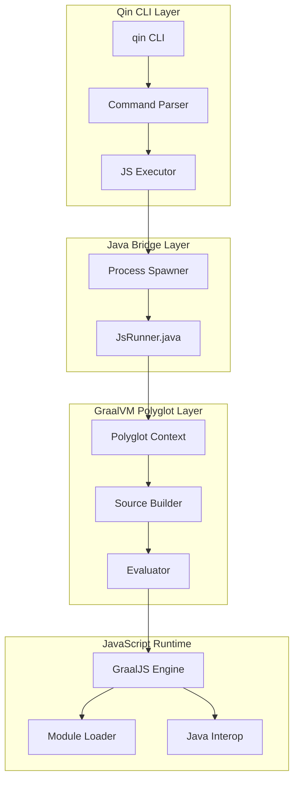
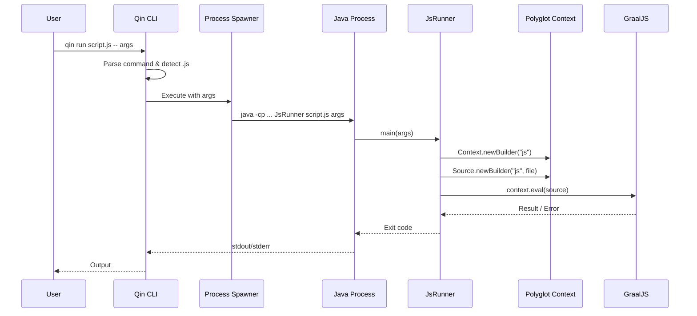

# Design Document: GraalVM Polyglot JavaScript Runner

## Overview

本设计为 Qin 构建工具添加基于 GraalVM Polyglot API 的 JavaScript 执行支持。与使用 GraalVM Node.js 运行时的方案不同，本方案通过 Java 桥接器直接使用 Polyglot API 执行 JavaScript，实现更紧密的 Java-JavaScript 互操作。

**执行流程：**
```
qin run xxx.js / qin xxx.js
        ↓
    Qin CLI (TypeScript/Bun)
        ↓
    启动 Java 进程 (GraalVM)
        ↓
    JsRunner.java (桥接器)
        ↓
    Polyglot Context + GraalJS
        ↓
    执行 JavaScript 文件
```

## Architecture



### 组件交互流程



## Components and Interfaces

### 1. Command Parser (TypeScript)

```typescript
// src/core/js-command-parser.ts

export interface JsCommandOptions {
  /** JavaScript 文件路径 */
  file: string;
  /** 传递给 JavaScript 的参数 */
  args: string[];
  /** 工作目录 */
  cwd: string;
}

export interface ParseResult {
  /** 是否是 JavaScript 执行命令 */
  isJsCommand: boolean;
  /** 解析后的选项 */
  options?: JsCommandOptions;
  /** 解析错误 */
  error?: string;
}

/**
 * 解析命令行参数，识别 JavaScript 执行命令
 * 支持: qin run xxx.js 和 qin xxx.js
 */
export function parseJsCommand(argv: string[]): ParseResult;

/**
 * 检查文件是否是 JavaScript 文件
 */
export function isJavaScriptFile(filePath: string): boolean;

/**
 * 解析相对路径为绝对路径
 */
export function resolveFilePath(filePath: string, cwd: string): string;
```

### 2. JavaScript Executor (TypeScript)

```typescript
// src/core/js-executor.ts

export interface ExecutionResult {
  /** 退出码 */
  exitCode: number;
  /** 标准输出 */
  stdout: string;
  /** 标准错误 */
  stderr: string;
}

export interface ExecutorOptions {
  /** JavaScript 文件路径 */
  file: string;
  /** 命令行参数 */
  args: string[];
  /** 工作目录 */
  cwd: string;
  /** 环境变量 */
  env?: Record<string, string>;
}

/**
 * 使用 GraalVM Polyglot API 执行 JavaScript 文件
 */
export async function executeJavaScript(options: ExecutorOptions): Promise<ExecutionResult>;

/**
 * 构建 Java 执行命令
 */
export function buildJavaCommand(options: ExecutorOptions): {
  command: string;
  args: string[];
  classpath: string;
};

/**
 * 获取 JsRunner 类路径
 */
export function getJsRunnerClasspath(): string;
```

### 3. JsRunner (Java Bridge)

```java
// src/java/JsRunner.java

package qin.runtime;

import org.graalvm.polyglot.*;

/**
 * JavaScript 执行桥接器
 * 使用 GraalVM Polyglot API 执行 JavaScript 文件
 */
public class JsRunner {
    
    /**
     * 主入口点
     * @param args [0] = JavaScript 文件路径, [1...] = 脚本参数
     */
    public static void main(String[] args);
    
    /**
     * 创建配置好的 Polyglot Context
     * - 启用 JavaScript 语言
     * - 启用 ES 模块支持
     * - 启用 Java 互操作
     */
    private static Context createContext();
    
    /**
     * 从文件创建 Source 对象
     */
    private static Source createSource(String filePath) throws IOException;
    
    /**
     * 设置全局 args 数组
     */
    private static void setupArgs(Context context, String[] args);
    
    /**
     * 格式化并输出错误信息
     */
    private static void handleError(PolyglotException e);
}
```

### 4. Error Formatter (TypeScript)

```typescript
// src/core/js-error-formatter.ts

export interface JsError {
  /** 错误类型: syntax | runtime | file | graalvm */
  type: 'syntax' | 'runtime' | 'file' | 'graalvm';
  /** 错误消息 */
  message: string;
  /** 文件路径 */
  file?: string;
  /** 行号 */
  line?: number;
  /** 列号 */
  column?: number;
  /** 堆栈跟踪 */
  stack?: string;
}

/**
 * 解析 Java 进程的错误输出
 */
export function parseJsError(stderr: string): JsError;

/**
 * 格式化错误为用户友好的输出
 */
export function formatJsError(error: JsError): string;
```

## Data Models

### 命令解析结果

```typescript
interface CommandParseResult {
  /** 命令类型 */
  type: 'js-run' | 'js-shorthand' | 'other';
  /** JavaScript 文件路径 (原始) */
  rawPath?: string;
  /** JavaScript 文件路径 (解析后的绝对路径) */
  resolvedPath?: string;
  /** 脚本参数 */
  scriptArgs: string[];
  /** 是否存在 */
  fileExists?: boolean;
}
```

### Java 命令构建结果

```typescript
interface JavaCommandSpec {
  /** Java 可执行文件路径 */
  javaPath: string;
  /** 类路径 */
  classpath: string[];
  /** 主类 */
  mainClass: string;
  /** JVM 参数 */
  jvmArgs: string[];
  /** 程序参数 */
  programArgs: string[];
}
```

### 执行状态

```typescript
interface ExecutionState {
  /** 进程 ID */
  pid?: number;
  /** 开始时间 */
  startTime: number;
  /** 结束时间 */
  endTime?: number;
  /** 退出码 */
  exitCode?: number;
  /** 是否被终止 */
  killed: boolean;
}
```

## Correctness Properties

*A property is a characteristic or behavior that should hold true across all valid executions of a system-essentially, a formal statement about what the system should do. Properties serve as the bridge between human-readable specifications and machine-verifiable correctness guarantees.*

### Property 1: JavaScript File Recognition

*For any* file path string ending with `.js` or `.mjs`, the command parser SHALL recognize it as a JavaScript file and route it to the JavaScript executor, regardless of whether the command uses `qin run file.js` or `qin file.js` form.

**Validates: Requirements 1.1, 1.2**

### Property 2: Path Resolution Consistency

*For any* relative file path and working directory, the path resolver SHALL produce an absolute path that, when combined with the working directory, points to the same location as the original relative path.

**Validates: Requirements 1.3**

### Property 3: Error Message Path Inclusion

*For any* file-related error (file not found, access denied, etc.), the error message SHALL contain the original file path that caused the error.

**Validates: Requirements 1.4, 4.4**

### Property 4: Java Command Construction

*For any* JavaScript execution request, the Java command builder SHALL produce a command that includes:
- The GraalVM java executable
- JsRunner as the main class
- The JavaScript file path as the first program argument
- All user-provided arguments after the file path

**Validates: Requirements 2.1, 2.2, 2.4, 2.5**

### Property 5: Argument Forwarding

*For any* list of command line arguments passed after `--`, the JavaScript runtime SHALL receive those exact arguments in the same order via the global `args` array.

**Validates: Requirements 3.1, 3.2**

### Property 6: Error Location Formatting

*For any* JavaScript syntax or runtime error that includes location information, the formatted error output SHALL contain the file name, line number, and (for syntax errors) column number.

**Validates: Requirements 4.1, 4.2**

### Property 7: ES Module Support

*For any* JavaScript file using ES6+ syntax including `import` and `export` statements, the Polyglot Context SHALL successfully parse and execute the code without syntax errors related to module syntax.

**Validates: Requirements 5.1, 5.2, 5.3**

### Property 8: Java Interop Functionality

*For any* JavaScript code using `Java.type(className)` where className is a valid Java class on the classpath, the Polyglot Context SHALL return a usable reference to that Java class that can be instantiated and have methods called on it.

**Validates: Requirements 6.1, 6.2, 6.3**

### Property 9: Classpath Construction

*For any* JavaScript execution request, the classpath SHALL include:
- The JsRunner class location
- GraalVM Polyglot SDK dependencies
- The current working directory for user Java classes

**Validates: Requirements 7.2, 7.3**

## Error Handling

### 错误类型和处理

| 错误类型 | 触发条件 | 处理方式 |
|---------|---------|---------|
| `FileNotFoundError` | JavaScript 文件不存在 | 显示文件路径和建议检查路径 |
| `FileAccessError` | 无法读取文件 | 显示权限错误和文件路径 |
| `SyntaxError` | JavaScript 语法错误 | 显示文件名、行号、列号和错误描述 |
| `RuntimeError` | JavaScript 运行时错误 | 显示错误消息和堆栈跟踪 |
| `GraalVMNotFoundError` | GraalVM 未安装 | 显示安装指南链接 |
| `ClasspathError` | JsRunner 或依赖缺失 | 显示缺失的组件和修复建议 |

### 错误输出格式

```
Error: [ErrorType]
  File: path/to/file.js
  Line: 10, Column: 5
  
  Message: Unexpected token '}'
  
  Stack:
    at functionName (file.js:10:5)
    at main (file.js:20:1)
```

## Testing Strategy

### 测试框架

使用 **fast-check** 作为 TypeScript 的属性测试库，使用 **Vitest** 作为单元测试框架。

### 测试文件结构

```
src/core/
├── js-command-parser.ts
├── js-executor.ts
├── js-error-formatter.ts
└── __tests__/
    ├── js-command-parser.test.ts
    ├── js-command-parser.property.test.ts
    ├── js-executor.test.ts
    ├── js-executor.property.test.ts
    └── js-error-formatter.property.test.ts

src/java/
├── JsRunner.java
└── __tests__/
    └── JsRunnerTest.java
```

### 属性测试标注格式

```typescript
/**
 * **Feature: graalvm-polyglot-js-runner, Property 1: JavaScript File Recognition**
 * **Validates: Requirements 1.1, 1.2**
 */
test.prop([fc.string()])('recognizes .js files', (filename) => {
  // property test implementation
});
```

### 测试覆盖

| 组件 | 单元测试 | 属性测试 |
|-----|---------|---------|
| Command Parser | 具体命令示例 | Property 1, 2 |
| JS Executor | 执行流程 | Property 4, 5, 9 |
| Error Formatter | 错误格式示例 | Property 3, 6 |
| JsRunner (Java) | Context 创建 | Property 7, 8 |
